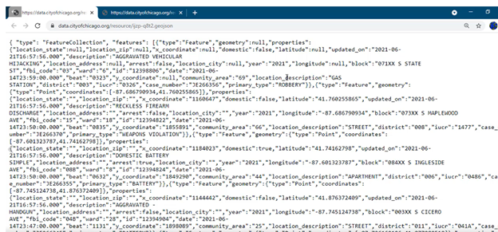
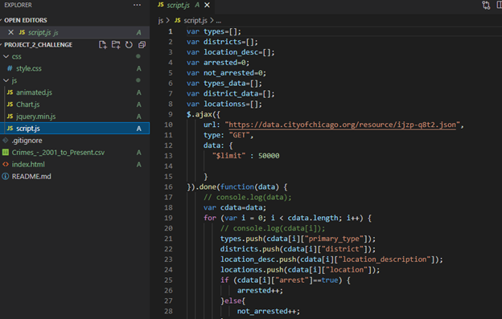
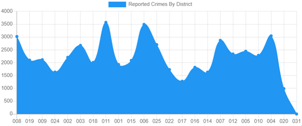
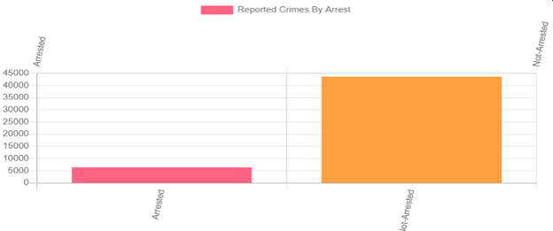
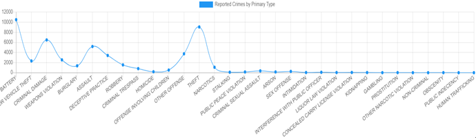
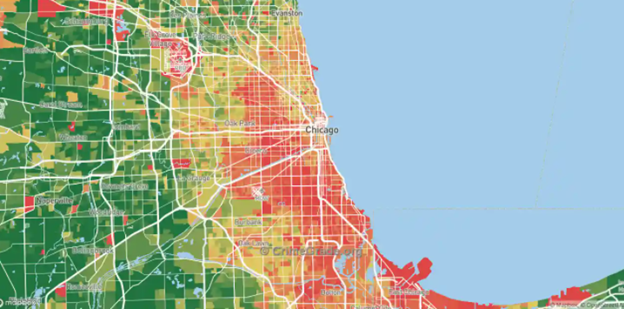

## project_2 ##
=======

**INTRODUCTION**

The development of new technology allows the present century to predict the dangerous situations to which an individual may be subjected, based on data collected and recorded in the past. We live daily in fear of murders and crimes that geographically influence our movements in our various cities. Our Project is about crimes, specifically in the city of Chicago.
And our main goal is to analyze the criminal data recorded in the Chicago police website from 2001 to the present.
This analysis consists of developing a technology platform publicly available to visitors and citizens of the city of Chicago that will enable them to make decisions, and answer to their questions such as:

- What are safe places for living, or visiting in Chicago?
- Where are suitable streets for day and night walking?

The answers to these questions allowed us to produce visualized clues indicating places with high risk of crime, day, or night.

The purpose of analyzing data, is to educate people about the different types of crime; to be aware of them.

That said, we will present in the following page the first approach of our analysis on crime in the city of Chicago.

DATA EXTRACTION.
https://data.cityofchicago.org/Public-Safety/Crimes-2001-to-present-Dashboard/5cd6-ry5g

How did we collected data?

We have used json format as showing below: 

 

We have classified data as showing on the terminal: primary type, district, locationdescription, arrest, etc

We have set limit of 50 000 rows of data here because if we don’t it will only display 1000  rows.

 
 

Here is data about district report.

 

Below is report crime by arrest. Means people that have been arrested from all crime’s authors.

Below are all cases of primary type of crime.

Chicago crime rate as follow:

 

 Now, let's go to the map presentation.  
 Here, we show how users will be able to use our map technology option to zoom the city of Chicago, and see differents places, street address, locations where crimes occured. 

